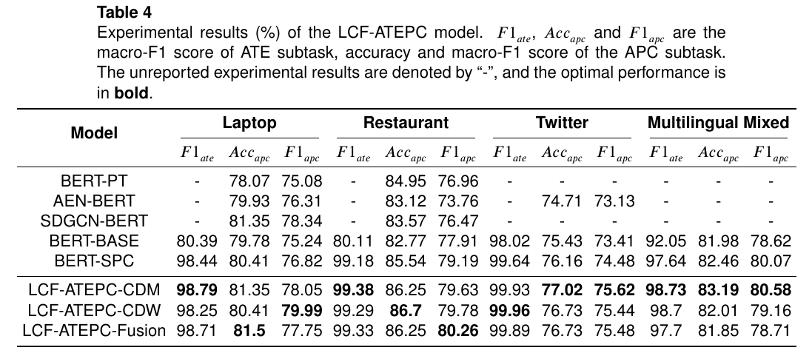
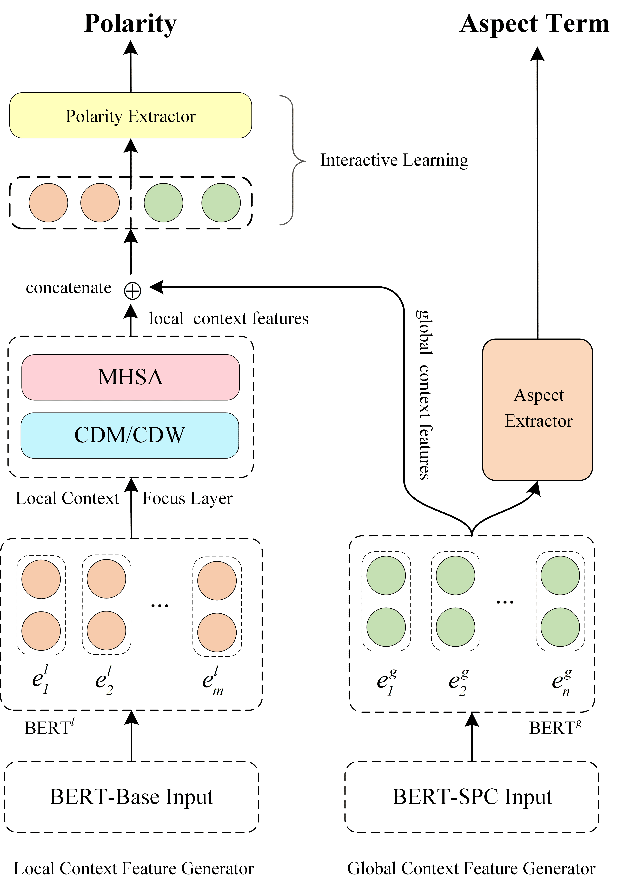

# LCF-ATEPC

codes for paper [A Multi-task Learning Model for Chinese-oriented Aspect Polarity Classification and Aspect Term Extraction](https://arxiv.org/abs/1912.07976)

> LCF-ATEPC，面向中文及多语言的ATE和APC联合学习模型，基于PyTorch 


> LCF-ATEPC,  a multi-task learning model for Chinese and multilingual-oriented ATE and APC task, based on PyTorch


[](https://paperswithcode.com/sota/aspect-based-sentiment-analysis-on-semeval?p=a-multi-task-learning-model-for-chinese)

## Requirement

* Python >= 3.7
* PyTorch >= 1.0
* [pytorch-transformers](https://github.com/huggingface/pytorch-transformers) >= 1.2.0


## Training
> We use the configuration file to manage experiments setting

Traininng on Chinese-oriented Review dataset: complete the experiments configuration [exp-batch-chinese.json](./exp-batch-chinese.json) and run 

```sh
python batch_train_chinese.py
```

Else traininng on English or multilingual Review dataset: complete the experiments configuration [exp-batch.json](./exp-batch.json) and run 

```sh
python batch_train.py
```

## Out of Memory

Since BERT models require a lot of memory. If the out-of-memory problem while training the model, here are the ways to mitigate the problem:
1. Reduce the training batch size ( train_batch_size = 4 or 8 )
2. Reduce the longest input sequence ( max_seq_length = 40 or 60 )
3. Use a unique BERT layer to model for both local and global contexts

## Model Performance

### Optimal Performance on the Chinese Review Datesets



### Optimal Performance on the SemEval-2014 Task4 Datasets


Full experimental results and performance comparisons can be obtained from our [paper]((https://arxiv.org/abs/1912.07976)).

## Model Architecture


## Notice

We cleaned up and refactored the original codes for easy understanding and reproduction.
Due to the busy schedule, we didn't test all the training situations. If you find any issue in this repo,
You can raise an issue or submit a pull request, whichever is more convenient for you.

## Citation

If this repository is helpful to you, please cite our paper:

    @misc{yang2019multitask,
        title={A Multi-task Learning Model for Chinese-oriented Aspect Polarity Classification and Aspect Term Extraction},
        author={Heng Yang and Biqing Zeng and JianHao Yang and Youwei Song and Ruyang Xu},
        year={2019},
        eprint={1912.07976},
        archivePrefix={arXiv},
        primaryClass={cs.CL}
    }

## Licence

MIT License

